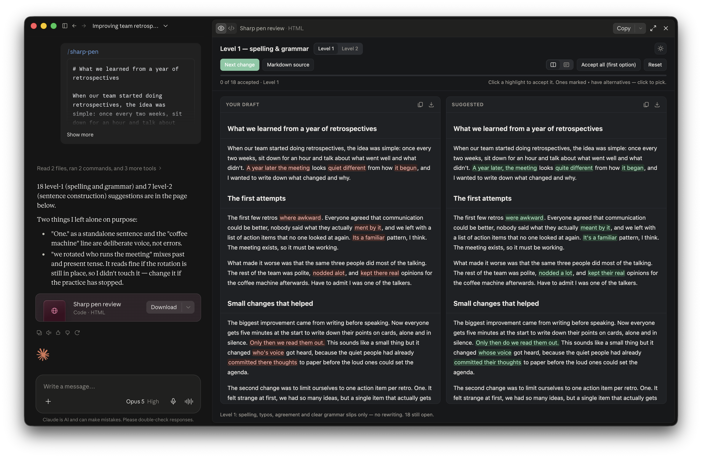

<p align="center">
  <picture>
    <source media="(prefers-color-scheme: dark)" srcset="docs/assets/logo-dark-transparent.png">
    
  </picture>
</p>

<p align="center">
  <strong>Grammarly-style proofreading, run by your AI assistant. You keep the pen.</strong>
</p>

<p align="center">
  <a href="https://nobbettt.github.io/sharp-pen/"></a>
  <a href="#install"></a>
  <a href="https://github.com/Nobbettt/sharp-pen/releases/latest/download/sharp-pen-latest.zip"></a>
</p>

---

Grammarly-style proofreading, run by your AI assistant. It fixes your writing
without changing your tone or reformulating what you wanted to say. Hand it a
draft and it hands back a review page: your text on the left, suggestions on
the right, every difference clickable. Accept a change with one click; when
there is more than one reasonable phrasing, pick from a dropdown. Nothing is
applied until you say so.

https://github.com/user-attachments/assets/b6a5560d-e13b-4930-a54c-0fd3008aa696

It is packaged as an agent skill, a folder with instructions and two small
Python scripts, so it works in any client that reads the skill format: Claude
Code, the Claude app, Codex, Copilot CLI and others.

Two passes, toggled in the page:

- **Level 1 — spelling and grammar.** Things that are wrong: typos, agreement,
  prepositions, missing articles, homophones, comma splices.
- **Level 2 — sentence construction.** Fragments, broken parallelism, buried
  points, sentences that trail off. One entry per sentence.

The left pane is always your text byte for byte. The skill suggests form, not
substance: it never changes what a sentence claims, strips a hedge, or makes
casual prose corporate.

## Why

Many writers want to do the rough draft themselves. Getting the words down is
part of the thinking, and handing it to a model takes that away. What they
want afterwards is what Grammarly offers: catch the typos, fix the grammar,
flag the sentence that doesn't quite work, and leave everything else alone.
Asking a general assistant for that is surprisingly hard. Tell it to proofread
and it rewrites, smooths out the voice, drops a hedge the author meant, or
quietly changes a claim. And it hands back one version, take it or leave it.
sharp-pen constrains the model to form, not substance, and splits its
suggestions into hard errors and optional sentence fixes. Where more than one
phrasing would do, it offers two or three alternatives rather than picking for
you, so the choice of wording stays with the author. Every suggestion is a
separate click. The author stays the author. The AI is a careful copy editor
that never touches the text without asking.

## Example

**[Live demo](https://nobbettt.github.io/sharp-pen/)** — a 400-word blog draft
reviewed by sharp-pen. Toggle between Level 1 and Level 2, click a highlight to
accept it, open a dropdown where more than one phrasing fits, then download the
result.

## Install

**Claude Code**

```
/plugin marketplace add Nobbettt/sharp-pen
/plugin install sharp-pen@sharp-pen
```

Then paste a draft into any project and ask for proofreading, or run
`/sharp-pen:review` followed by the text.

**Claude app / Cowork** — download
[`sharp-pen-latest.zip`](https://github.com/Nobbettt/sharp-pen/releases/latest/download/sharp-pen-latest.zip)
and upload it as a skill. Older versions are on the
[Releases](https://github.com/Nobbettt/sharp-pen/releases) page.

**Codex** — Codex picks up skills from `~/.agents/skills/`. Unzip the latest
release there:

```bash
mkdir -p ~/.agents/skills
curl -L https://github.com/Nobbettt/sharp-pen/releases/latest/download/sharp-pen-latest.zip -o /tmp/sharp-pen.zip
unzip -o /tmp/sharp-pen.zip -d ~/.agents/skills
```

Then type `$sharp-pen` followed by your text, or just ask for proofreading. For
a single project, unzip into `.agents/skills/` at the repo root instead.

**Other clients (Copilot CLI, …)** — unzip the same release into your client's
skills directory so it contains a `sharp-pen/` folder with `SKILL.md` at its
root.

Requirements: Python 3. The scripts use only the standard library.

## Use

Paste or point at a draft and ask for proofreading, or type `sharp-pen`
followed by the text:

```
/sharp-pen please look over this before I publish it:

Last month I set myself a challenge: build a small side project in one
weekend. Have to say it took alot longer then that.
```

The assistant saves your text untouched, works out the suggestions, builds the
review page and opens it for you. Click through the changes, pick the phrasing
you want where there are alternatives, and download the finished text from the
page. Your original is never edited in place.

In the Claude desktop app the review page opens right beside the conversation:



## About the author

I'm Norbert Laszlo, an AI solutions architect with a background in data
science and software engineering. I build tools for working with AI agents and
write about evaluation, agents and practical AI product work at
[norbertlaszlo.com](https://norbertlaszlo.com/) and on
[Medium](https://medium.com/@norbert-laszlo).
