# Mermaid Preview Rendering Fixture

> **Fixture only:** use this document to visually validate Mermaid diagram rendering in the preview. Switch between the Light, Dark, and Auto themes, and between split and inline views. Each diagram should render in every pane.

This paragraph has a deliberate typo so analysis has something to sugest next to the diagrams.

## Flowchart

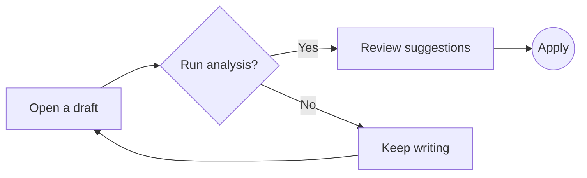

## Flowchart with subgraphs and styles

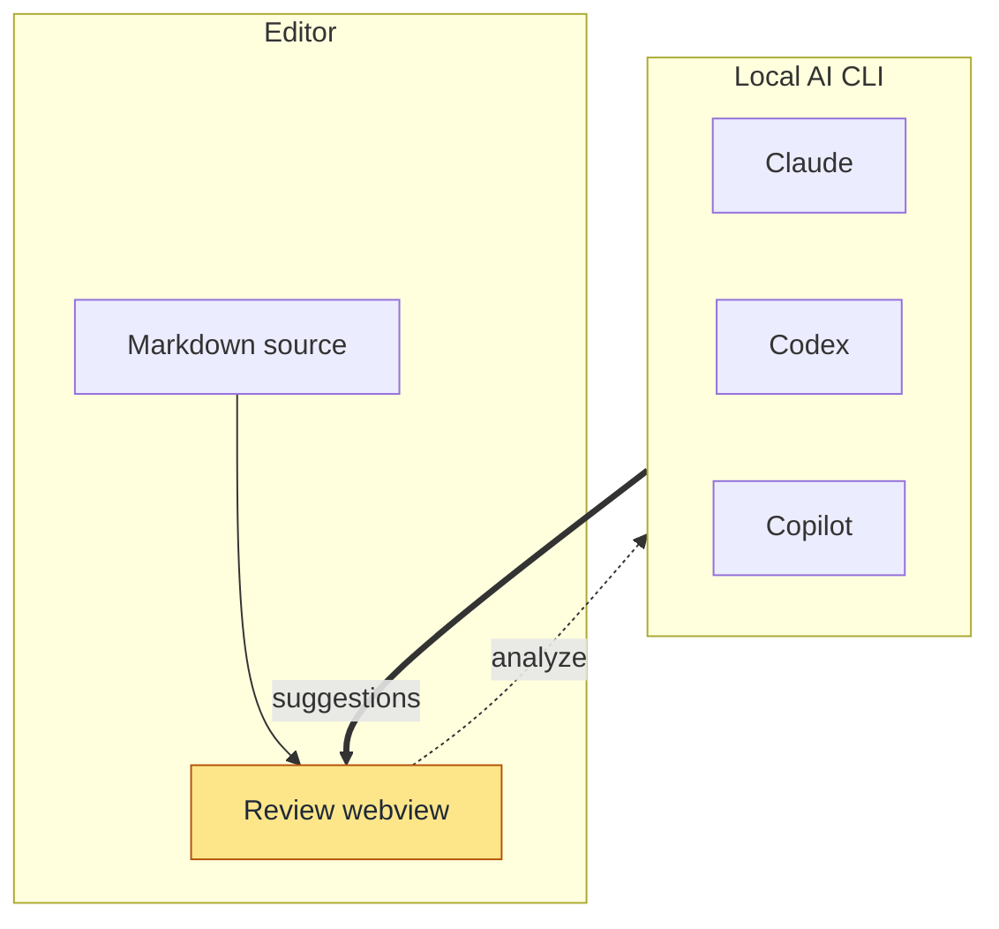

## Sequence diagram

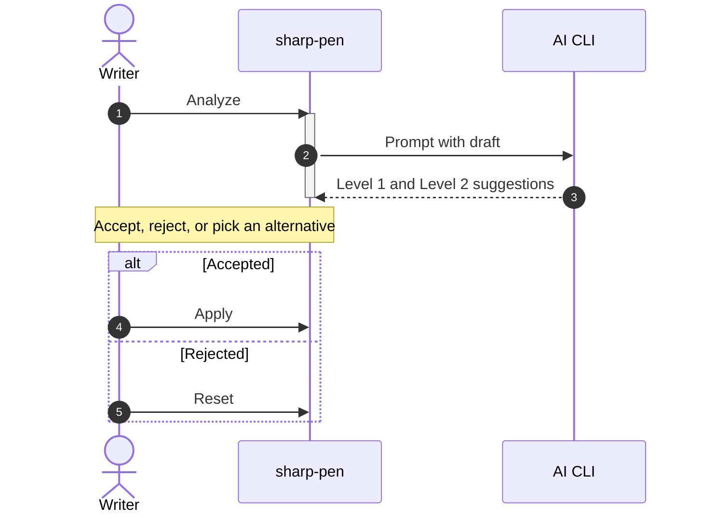

## Class diagram

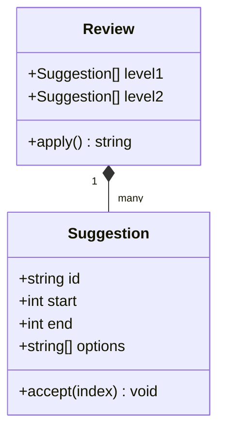

## State diagram

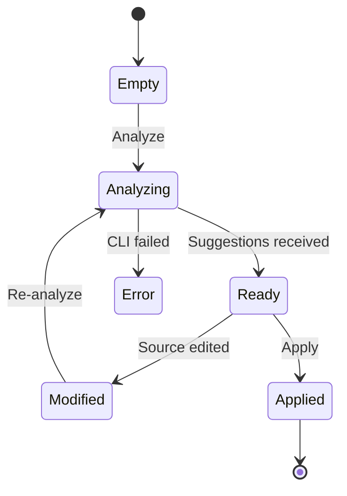

## Entity relationship diagram

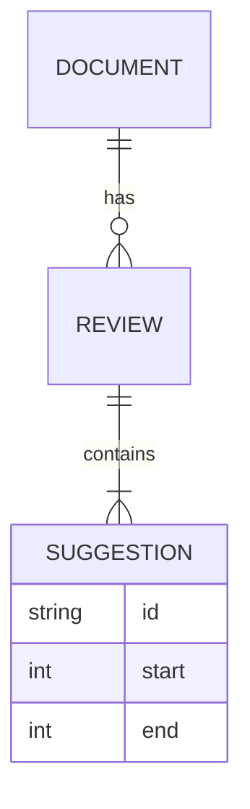

## Gantt chart

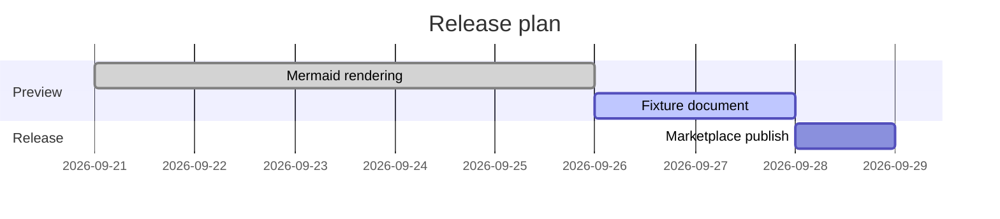

## Pie chart

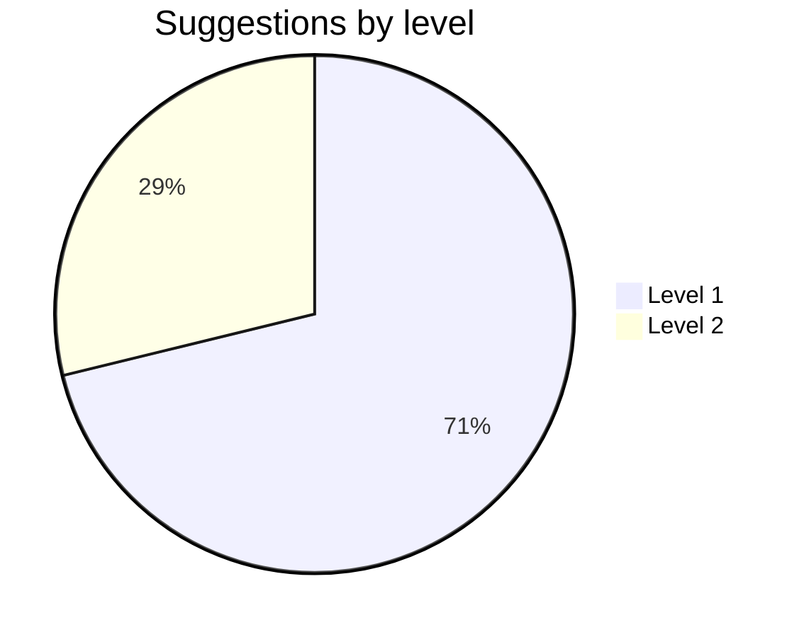

## Git graph

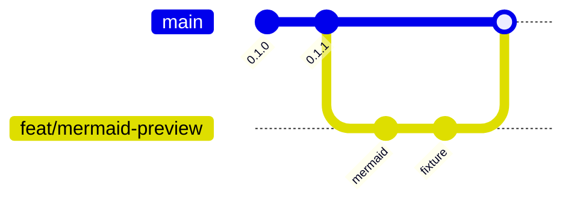

## Mindmap

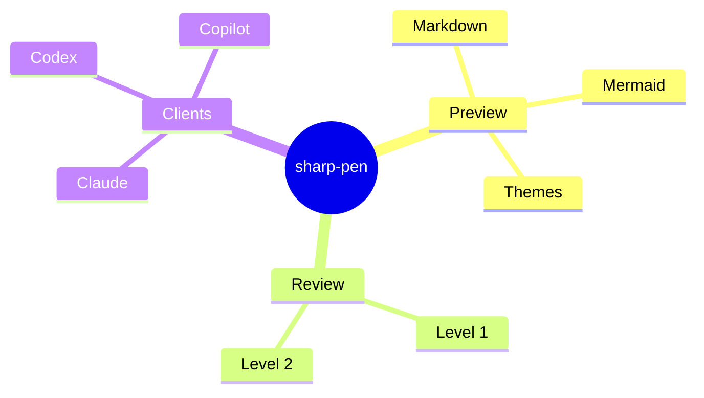

## Timeline

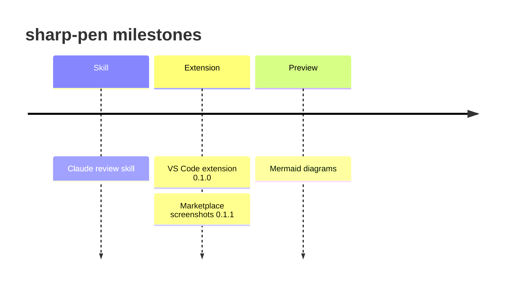

## User journey

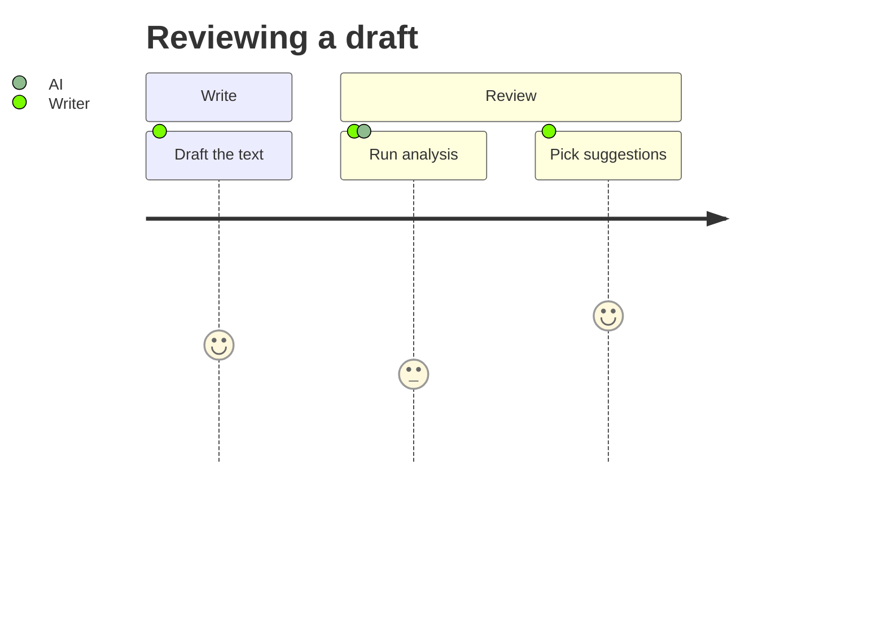

## Quadrant chart

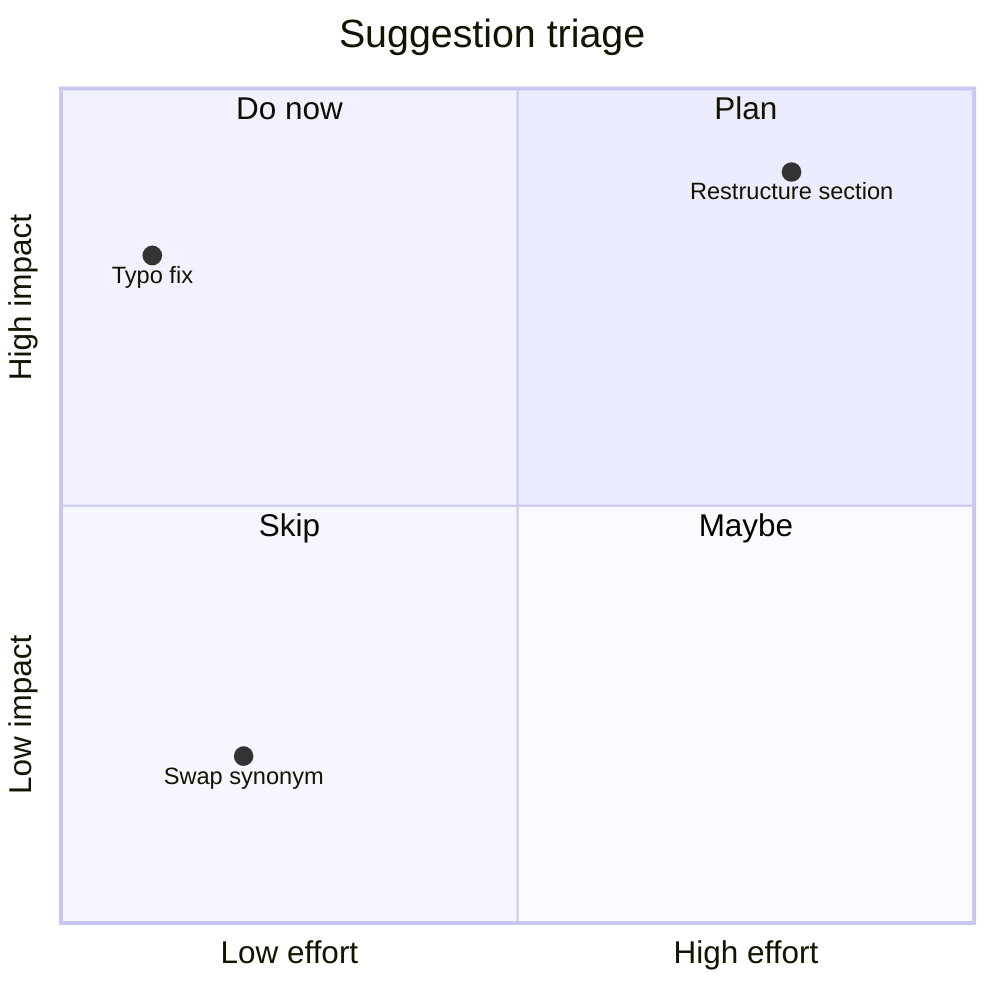

## XY chart

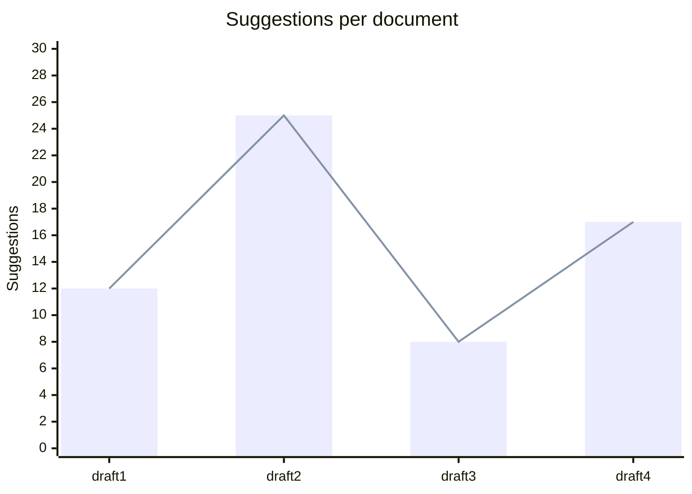

## Long labels and special characters

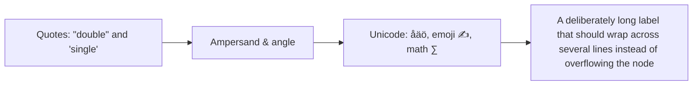

## Mermaid fence with metadata

The info string carries extra metadata after the language; it should still render.

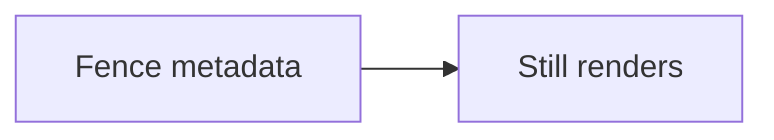

## Uppercase language tag

```Mermaid
flowchart LR
  upper[MERMAID tag] --> same[Same renderer]
```

## Invalid diagram (expected fallback)

This block should show the "could not be rendered" message and its source.

```mermaid
flowchart LR
  A --> 
  this is not valid mermaid ((
```

## Empty mermaid fence (expected plain block)

```mermaid
```

## Non-mermaid code for comparison

```javascript
const diagram = "flowchart LR; A-->B";
console.log(diagram);
```

```text
flowchart LR
  A --> B
```

The text block above has diagram syntax but no mermaid tag, so it must stay as code.
